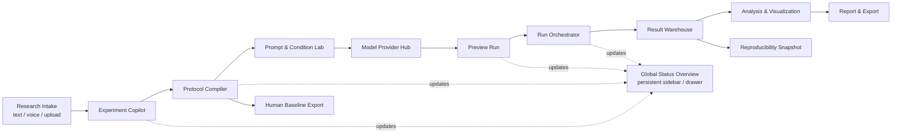

# 核心功能与架构草案

版本：0.1
日期：2026-05-21

## 1. 产品模块总览

LLM Behavior Lab 的核心不是把所有能力一次性堆到界面上，而是让研究者沿着一条低认知负荷的研究路径推进：

1. 先收集研究输入。
2. 统一进入 Experiment Copilot 做意图澄清。
3. Copilot 更新全局状态总览，让用户随时看到哪些设计块已经可推进、哪些仍需确认。
4. 用户逐步确认实验设计、prompt、模型、preview、正式运行和报告。

因此，系统结构上可以有很多模块，但界面上必须保持“当前只做一步”的体验。



## 2. 核心 Feature 与 Motive

| Feature | 做什么 | 设计动机 |
|---|---|---|
| Experiment Copilot | 根据用户想法澄清假设、变量、条件、因变量、控制变量 | 解决“研究问题说得模糊，后面 prompt 和统计都歪掉”的问题 |
| Research Intake | 支持文字输入、语音转写、上传已有实验方案、上传人类和大模型合写的草案 | 用户的起点不一定是一句话；平台要接住半成品材料，但统一转入 Copilot |
| Global Status Overview | 在侧栏或顶部提供常驻总览入口，展示“研究问题、变量、条件、stimuli、prompt、模型、运行、分析”等设计块状态 | 提供状态可见性，让用户知道哪些内容已就绪、哪些需要补充；它是导航辅助，不是线性流程中的必经步骤 |
| Protocol Compiler | 把研究计划编译成机器可运行的实验协议 schema | 让实验不是散落的 prompt，而是可复现、可审查的 protocol |
| Prompt & Condition Lab | 管理 prompt、条件文本、版本、diff、平衡检查 | 降低 wording、条件长度、标签泄漏、诱导性表达带来的偏差 |
| Model Provider Hub | 统一管理不同模型、API key、参数、成本估算 | 避免每次实验都重复接 API，也让模型版本和参数可追踪 |
| Preview Run | 用小样本先检查输出格式、解析失败率、拒答、成本和异常 | 在正式运行前发现问题，符合人因工程中的 error prevention |
| Run Orchestrator | 批量运行 condition x model x repetition，支持 preview、重试、限额 | 把实验执行从手工脚本变成稳定、可恢复、可控成本的流程 |
| Result Warehouse | 保存 raw response、parsed response、prompt、模型参数、时间戳、成本 | 保证结果能追溯，不只留下一个分析表 |
| Analysis & Visualization | 输出频数、均值、条件差异、模型差异、heatmap、异常样本 | 让研究者快速判断实验是否有信号、哪里异常、下一步怎么改 |
| Report & Export | 导出 Markdown、CSV、JSONL、protocol、图表、方法段草稿 | 方便写论文、预注册、OSF 附件或团队复核 |
| Human Baseline Export | 把同一协议导出为 Qualtrics/jsPsych/Pavlovia/问卷材料 | 让 LLM 实验可以和人类实验对照，而不是孤立存在 |

## 3. 基于人因工程的产品设计原则

### 3.1 渐进披露

用户第一次进入时只看到普通界面：输入研究想法、上传材料、查看 Copilot 提出的下一步。复杂的 schema、模型参数、prompt diff 和统计图表都不应在第一屏出现。

设计规则：

- 当前阶段只显示完成该阶段所需的信息。
- 高级配置默认折叠，但用户可以展开。
- 每一步都有“为什么需要这一步”的短说明。
- 用户确认一个任务块后，系统再解锁下一步。

### 3.2 降低记忆负担

研究者不应记住完整实验设计术语才能使用平台。界面应把抽象概念转成可识别的卡片：

- `研究问题`：你想比较什么？
- `自变量`：你要操纵什么？
- `因变量`：你要观察什么输出？
- `条件`：每个自变量有哪些水平？
- `模型被试`：哪些 LLM 参与实验？
- `质量检查`：是否能解析、是否有 prompt confound、成本是否可接受？

### 3.3 用户保持控制权

Agent 可以生成建议，但不能直接替用户启动正式实验。必须有明确的确认点：

- 确认研究问题。
- 确认条件矩阵。
- 确认 prompt 和输出格式。
- 确认模型、重复次数和预算。
- 通过 preview run 后，确认正式运行。
- 报告生成前，确认分析口径。

### 3.4 错误预防优先

比起运行后再解释失败，系统应在运行前阻止常见错误：

- 条件文本长度差异过大。
- 条件标签泄漏到 prompt。
- 输出 schema 太复杂导致解析失败。
- 模型参数不一致。
- 重复采样过少导致结果不稳定。
- 预算超过用户设定上限。

### 3.5 状态可见

用户始终知道当前处于哪一步、还差什么、下一步是什么：

- 顶部或侧栏显示常驻总览入口：当前阶段、总体进度、下一步行动。
- 总览抽屉显示轻量 checklist，但不作为 01-08 主流程步骤。
- 每个任务有状态：`needs input`、`drafted`、`needs review`、`approved`、`blocked`。
- 系统生成的内容和用户修改的内容要有版本记录。

## 4. 用户输入入口与统一 Copilot 流程

用户输入可以有多种形式，但后续流程必须统一：

1. **文字输入**：用户直接描述研究想法、问题、假设或实验范式。
2. **语音输入**：平台转写语音，并让用户先确认转写文本。
3. **上传方案**：用户上传已有实验方案、论文方法段、问卷、prompt 草稿、或者人类和大模型合写的实验设计。
4. **粘贴材料**：用户粘贴聊天记录、已有 prompt、条件文本、CSV stimuli。

所有入口都先转成 `Research Intake Object`：

```yaml
research_intake:
  source_type: text | voice | upload | pasted_material
  raw_content_ref: file_or_text_id
  user_goal: null
  extracted_candidates:
    research_question: null
    hypothesis: []
    independent_variables: []
    dependent_variables: []
    conditions: []
    stimuli: []
    models: []
    analysis_hints: []
  confidence:
    research_question: low | medium | high
    variables: low | medium | high
    output_format: low | medium | high
  unresolved_questions: []
```

然后进入 Experiment Copilot：

1. Copilot 先摘要用户输入，告诉用户“我理解你想研究什么”。
2. Copilot 标出已识别和未识别的信息。
3. Copilot 一次只问一个关键澄清问题，优先用选择题。
4. Copilot 更新全局状态总览。
5. 用户完成细节确认和运行细节确认后，直接进入 protocol 编译。

## 5. 分步任务流程与每步 Prompt 设计

### 5.1 Stage 0：Research Intake

用户界面：普通输入页，包含文字框、录音入口、上传入口和示例模板。

Agent 目标：把任意输入转成结构化 intake，不做最终实验设计。

Prompt 设计：

```text
你是 LLM 行为实验平台的研究输入解析助手。
请只做输入理解，不要开始设计完整实验。
从用户材料中提取：研究问题、假设、自变量、因变量、条件、stimuli、模型、输出格式、分析提示。
对每一项标注置信度，并列出最多 3 个需要用户澄清的问题。
如果材料来自上传文件，保留原文引用位置，避免捏造。
```

输出：`Research Intake Object`。

### 5.2 Stage 1：Experiment Copilot

用户界面：显示需求摘要、假设问题和测量形式；模型、API 与重复试次统一放到模型与预算步骤中设置。全局总览只作为侧栏入口存在。

Agent 目标：澄清研究设计，产出协议编译所需的关键字段，并同步更新全局总览。

Prompt 设计：

```text
你是行为科学和 LLM eval 的实验设计 copilot。
基于 Research Intake Object，生成一个逐步实验设计计划。
请优先保证内部效度：明确假设、自变量、因变量、控制变量、条件矩阵、随机化、输出格式、潜在 confound。
不要直接生成正式 prompt；先列出需要用户确认的设计决策。
每次只提出一个最高优先级问题，并给出 2-4 个可选答案。
```

输出：研究问题草案、变量草案、风险提示、下一问题、全局状态更新。

#### 内部实验设计原则库

参考 Howard J. Seltman《Experimental Design and Analysis》中对 behavioral/social science 实验的组织方式，Copilot 应把实验设计原则作为后台 system prompt 护栏，而不是在 02 页面中展示沉重的方法论 checklist。原则库落在 `app/prompts/experiment_design_principles.md`，后端在 `/api/intake` 和 `/api/protocol` 中读取，并注入 Copilot 的 system prompt。用户只看到轻量的摘要、假设问题、测量形式、模型和重复次数。

| 内部原则 | 设计实验时需要检查的细节 | 产出字段 |
| --- | --- | --- |
| 操作化定义 | 目标构念如何落到模型可输出、系统可解析的字段；是否有标准量表或 benchmark | `construct`, `measurement`, `coding_schema`, `benchmark_reference` |
| 变量角色与类型 | 哪些是操纵变量、结果变量、协变量、block、moderator/mediator；变量是分类、顺序、连续还是自由文本 | `independent_variables`, `dependent_variables`, `covariates`, `variable_types` |
| 实验结构 | 组间、组内、混合设计或 benchmark 对照；实验单位是什么；是否需要 counterbalancing | `design_type`, `unit`, `condition_matrix`, `counterbalancing` |
| 效度威胁 | 内部效度、构念效度、外部效度、Type I error、模型特异性风险 | `validity_checks`, `confounds`, `generalization_limits` |
| 重复采样与 power | 每个 condition x model cell 重复多少次；preview 与 formal run 的区别；成本和低 power 风险 | `preview_repetitions`, `formal_repetitions`, `power_note`, `budget_estimate` |
| 计划比较 | 核心比较是主效应、交互还是 planned contrast；confirmatory 与 exploratory 如何区分 | `planned_comparisons`, `contrast_plan`, `analysis_scope` |
| 分析前提与 QA | 解析率、异常输出、拒答、输出分布、条件文本平衡、统计模型前提 | `qa_checks`, `assumption_checks`, `exclusion_rules` |

### 5.3 非线性组件：Global Status Overview

用户界面：侧栏底部或顶部按钮里的轻量状态总览，而不是完整配置表或新的主流程页面。

状态块：

1. 确认研究问题和假设。
2. 确认变量与条件。
3. 确认 stimuli 来源。
4. 确认响应格式。
5. 生成 prompt candidates。
6. 选择模型与预算。
7. 运行 preview。
8. 修正问题。
9. 正式运行。
10. 生成报告。

Prompt 设计：

```text
请把当前实验整理成 4-8 个状态块，用于帮助用户判断现在能否继续推进。
每个状态块必须包含：当前状态、已确认内容、仍需补充的内容、阻塞条件、进入下一步的完成标准。
这个 overview 不是新的配置页，也不是线性流程步骤；不要把高级参数提前暴露给用户。
```

输出：状态列表和依赖关系。

### 5.4 Stage 3：Protocol Compiler

用户界面：只在用户完成细节确认和运行细节确认后出现。默认显示人类可读摘要，可展开 YAML/JSON。

Agent 目标：把确认过的任务块编译为 protocol。

Prompt 设计：

```text
请基于用户已确认的设计决策生成实验 protocol。
必须包含：design、factors、levels、stimuli、prompt_variables、output_schema、model_plan、scoring_plan、analysis_plan。
所有未确认项必须标记为 needs_review，不能自行假设。
请同时生成一版 plain-language summary，方便非技术研究者审查。
```

输出：protocol draft、plain-language summary、needs_review 列表。

### 5.5 Stage 4：Prompt & Condition Lab

用户界面：先显示条件对照表，再显示 prompt。每个 prompt 旁边显示“为什么这样写”和“可能偏差”。

Agent 目标：生成 prompt candidates，并做条件平衡与输出可解析性检查。

Prompt 设计：

```text
请为该实验生成 prompt 模板和条件材料。
要求：不同条件只有理论变量发生变化；长度、语气、格式尽量平衡；不要泄漏条件标签；输出必须符合 schema。
请提供 2-3 个 prompt variant，并解释每个 variant 的优缺点。
请输出潜在 confound 检查结果。
```

输出：prompt variants、condition diff、confound checklist、推荐版本。

### 5.6 Stage 5：Model & Run Plan

用户界面：模型选择、重复次数、预算滑块、preview 按钮。

Agent 目标：把实验设计转换为可控成本的运行计划。

Prompt 设计：

```text
请基于 protocol 和用户预算生成 run plan。
计算 condition x stimuli x models x repetitions 的调用量。
估计成本、时间、失败重试余量。
如果预算过高，给出缩减方案：减少模型、减少 repetitions、先跑 preview、减少 prompt variants。
```

输出：run plan、预算估计、缩减建议。

### 5.7 Stage 6：Preview Run QA

用户界面：质量检查报告，而不是结果解读页。

Agent 目标：判断正式运行是否准备好。

Prompt 设计：

```text
请审查 preview run 结果。
重点检查：解析失败率、拒答率、异常长输出、条件间 prompt 不平衡、模型调用错误、成本偏差。
请给出 go / revise / stop 建议。
如果 revise，请指出最小修改项。
不要对实验假设做正式结论。
```

输出：QA 状态、最小修正建议、是否可正式运行。

### 5.8 Stage 7：Formal Run, Analysis, Report

用户界面：运行监控、结果、报告分成三个连续页面。

Agent 目标：执行正式 run，生成谨慎的初步分析。

Prompt 设计：

```text
请基于正式 run 数据生成探索性分析报告。
必须区分 model behavior 和 human behavior。
报告包括：实验设计、模型参数、数据质量、主要描述统计、条件比较、模型比较、异常样本、限制。
不要声称因果结论；不要把 LLM 结果解释为人类心理机制。
```

输出：结果摘要、图表说明、报告草稿、导出包。

## 6. 核心模块

### 6.1 Experiment Copilot

职责：把用户的自然语言想法转换为结构化研究计划。

关键能力：

- 提取研究问题、假设、变量、实验条件、因变量、控制变量。
- 判断实验类型：forced-choice、rating、free response、multi-turn interaction。
- 给出设计提醒：组间/组内、随机化、重复采样、潜在 confound、统计分析建议。
- 生成 protocol draft，并标记需要用户确认的高风险项。

输出：实验协议草案，不直接启动运行。

### 6.2 Protocol Compiler

职责：把研究计划编译为机器可运行的实验配置。

应支持：

- factors/levels 条件矩阵。
- stimuli/trials/block。
- prompt template 与变量插值。
- output schema。
- scorer/grader 配置。
- model run plan。
- analysis plan。

建议 schema 示例：

```yaml
experiment:
  id: risk-framing-demo
  title: Risk Preference Under Gain/Loss Framing
  language: zh-CN
  design:
    type: within_subject
    factors:
      - name: frame
        levels: [gain, loss]
      - name: probability
        levels: [low, high]
    repetitions_per_cell: 30
    randomization: shuffled_by_model
  stimuli:
    source: inline
    items:
      - id: s001
        scenario: "..."
        variables:
          frame: gain
          probability: low
  prompts:
    system: "You are a participant in a behavioral decision-making study."
    user_template: |
      Please read the following scenario and choose one option.
      Scenario: {{ scenario }}
      Respond as JSON: {"choice": "A" | "B", "confidence": 1-7}
    output_schema:
      type: object
      required: [choice, confidence]
  models:
    - provider: openai
      model: gpt-5.5
      parameters:
        temperature: 0.7
        max_tokens: 100
    - provider: anthropic
      model: claude-sonnet
      parameters:
        temperature: 0.7
  scoring:
    parsed_fields: [choice, confidence]
    derived_variables:
      risk_seeking: "choice == 'B'"
  analysis:
    primary_outcome: risk_seeking
    comparisons:
      - frame
      - frame:model
```

### 6.3 Prompt & Condition Lab

职责：管理 prompt 和条件材料，减少 wording 偏差。

关键功能：

- Prompt 模板版本化、diff、hash。
- 条件文本平衡检查：长度、格式、情绪词、泄漏标签、暗示性措辞。
- Prompt variants：同一实验可生成多个等价措辞，用于稳健性检查。
- 输出格式检查：JSON schema、枚举值、Likert 范围、free text coding instruction。
- Blind condition labels：运行时可隐藏真实条件名，避免 prompt 泄漏。

### 6.4 Model Provider Hub

职责：统一管理模型接入和运行参数。

关键功能：

- Provider adapter：OpenAI-compatible、Anthropic、Google、local vLLM/Ollama 等。
- API key vault：用户 key / 平台 key 双模式。
- 模型参数模板：temperature、top_p、max_tokens、seed、reasoning effort 等。
- 成本估算：输入 tokens、输出 tokens、grader tokens。
- 速率限制和并发策略。
- 模型版本记录：provider model id、调用 endpoint、时间戳。

### 6.5 Run Orchestrator

职责：稳定执行实验。

关键功能：

- 生成 run plan：conditions x stimuli x models x repetitions。
- Preview run：每个条件少量样本，检查解析、拒答、成本、异常。
- 正式 run：队列、并发、重试、失败隔离。
- Run 状态：pending/running/paused/failed/completed。
- 中止与恢复。
- 预算上限和超额保护。

### 6.6 Result Warehouse

职责：保存原始与派生数据。

核心数据对象：

- `Experiment`：研究计划和元信息。
- `ProtocolVersion`：协议快照。
- `PromptVersion`：prompt 模板和 hash。
- `ModelConfig`：provider/model/params。
- `Run`：一次执行批次。
- `Trial`：一个 stimulus-condition-model-repetition 单元。
- `Response`：raw output、parsed output、finish reason、latency、tokens、cost。
- `Score`：规则评分、LLM grader、人工复核。
- `AnalysisReport`：图表、统计结果、导出文件。

必须记录的最小字段：

- experiment_id
- run_id
- protocol_version
- prompt_version
- condition
- stimulus_id
- model_provider
- model_id
- model_parameters
- request_timestamp
- response_timestamp
- raw_prompt
- raw_response
- parsed_response
- parse_status
- token_usage
- estimated_cost
- error_type

### 6.7 Analysis & Visualization

职责：给出可解释的初步分析，而不是替代正式统计建模。

MVP 分析能力：

- 描述统计：频数、比例、均值、中位数、标准差、置信区间。
- 条件比较：条件间差异、模型内差异、模型间差异。
- 交互初探：condition x model heatmap。
- 响应分布：Likert 分布、choice bar chart、free text topic/coding 摘要。
- 数据质量：解析失败率、拒答率、重复输出率、异常 token/cost。
- 稳健性：按 prompt variant、temperature、repetition 分层查看。

报告语气：

- 标记为 exploratory。
- 明确“模型行为”而非“人类行为”。
- 对 sample size、重复采样和 stochasticity 做限制说明。

### 6.8 Report & Export

导出内容：

- Markdown 报告。
- CSV/JSONL 原始数据。
- Protocol YAML/JSON。
- Prompt manifest。
- Model/run manifest。
- 图表 PNG/SVG。
- 方法段草稿。
- OSF/预注册友好摘要。

报告结构：

1. Research question。
2. Experimental design。
3. Models and parameters。
4. Prompt and stimuli。
5. Data collection/run metadata。
6. Primary results。
7. Exploratory visualization。
8. Data quality checks。
9. Limitations。
10. Reproducibility appendix。

### 6.9 Human Baseline Export

MVP 不直接招募人类被试，但应支持把同一协议导出为人类实验材料。

导出目标：

- Qualtrics 问卷结构草案。
- jsPsych timeline skeleton。
- Pavlovia/PsychoPy 材料说明。
- 脑岛/问卷平台可复制的问卷文本。
- Prolific/Credamo 招募描述、筛选条件、报酬估算草稿。

价值：

- 让研究者比较 human baseline 与 model behavior。
- 支持先用 LLM pilot，再进行人类预实验或正式实验。

## 7. MVP 页面/工作区

MVP 页面应以“普通界面 + 任务推进”为主，而不是一开始暴露完整配置后台。

1. Home / Dashboard：项目列表、最近 run、预算与状态。
2. Intake：文字、语音、上传、粘贴材料。用户只需要表达研究想法。
3. 细节确认：展示系统理解、缺失信息、最高优先级澄清问题。
4. Protocol Review：人类可读摘要优先，YAML/JSON 作为可展开高级视图。
5. Prompt Lab：条件对照、prompt variants、偏差检查、输出 schema。
6. Model & Budget：模型、API key、重复次数、预算和成本估计。
7. Preview QA：解析率、拒答率、异常输出、成本偏差，给出 go/revise/stop。
8. Formal Run：运行队列、状态、错误、暂停/恢复。
9. Analysis / Report：图表、表格、模型/条件比较、自动报告和导出包。
10. Settings：API key、团队权限、预算、数据保留。

Global Status Overview 不进入 01-08 主流程，作为侧栏或顶部的常驻入口展示当前阶段、总体进度、下一步行动、阻塞原因和轻量状态清单。

二期开发：人类基线导出入口不放在 02 细节确认或 08 结果报告的快速预实验流程中，后续作为独立 Human-compatible Protocol 模块处理。

## 8. 最小技术架构建议

### 8.1 前端

- Web app。
- 重点是 protocol editor、run monitor、results dashboard。
- 图表可先用 ECharts/Recharts/Plotly。

### 8.2 后端

- API service：实验、protocol、prompt、模型配置、报告。
- Worker service：模型调用、队列、重试、解析、评分。
- Scheduler/queue：支持并发和恢复。
- Provider adapters：统一模型调用接口。

### 8.3 数据层

- PostgreSQL：实验配置、run metadata、权限。
- Object storage：raw response、导出包、图表。
- Secret manager：API key。
- Optional analytics store：大规模 JSONL/Parquet。

### 8.4 分析层

- Python worker：pandas/statsmodels/scipy。
- MVP 可先生成 Markdown + static charts。
- 后续接 notebook 或 reproducible analysis script。

## 9. 关键设计原则

1. Protocol first：先生成可审查协议，再运行。
2. Raw data never disappears：解析失败也保留原始响应。
3. Every run is a snapshot：prompt、模型、参数、评分规则、分析计划都冻结。
4. Cost is visible：运行前估算、运行中追踪、超额自动停。
5. Human comparison is optional but first-class：平台不等同人类和 LLM，但方便比较。
6. Analysis is cautious：初步报告服务于下一步研究，而不是替代正式论文分析。

## 10. 首批可验证实验模板

建议先做这些模板，因为条件清晰、输出易解析、可与人类文献对照：

- Framing effect：收益/损失框架下风险选择。
- Ultimatum game：不同分配比例下接受/拒绝。
- Trolley dilemma：功利/义务论判断。
- Anchoring effect：不同锚点对数值估计影响。
- Trust game 文本版：信任投资与返还判断。
- Moral Foundations rating：不同道德基础文本评分。
- Persuasion resistance：不同来源可信度下观点变化。

## 11. 首个 demo 建议

Demo 名称：`risk-framing-multi-model`

目标：

- 用户输入一句研究想法。
- Agent 生成 2x2 条件设计。
- 接入 2 个模型，每格 20 次重复。
- 输出 choice proportion、confidence mean、condition x model heatmap。
- 导出 protocol YAML、raw JSONL、Markdown report。

成功标准：

- 90% 以上响应可解析。
- 每条响应都有完整元数据。
- 用户能看懂哪个模型在哪个 frame 下更 risk-seeking。
- 报告明确标注 exploratory 与 model behavior。
